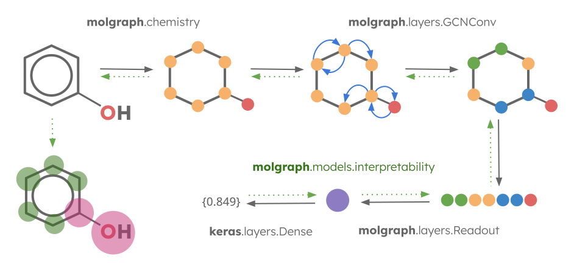

|

**MolGraph** is a light-weight Python package for applying graph neural networks (GNNs) on molecular graphs.
It is built with, and aims to be highly compatible with,
`TensorFlow <https://www.tensorflow.org/api_docs/python/tf>`_ and
`Keras <https://keras.io/>`_.

As **MolGraph** integrates well with TensorFlow and Keras APIs, 
it allows for easy, flexible and efficient implementations of GNNs, targeting a wide audience. 
Furthermore, a chemistry module is implemented to generate highly customizable molecular graphs.

.. note::
  Currently, Keras 3 does not support extension types. As soon as it does, it is hoped that MolGraph will migrate to Keras 3.

**Overview of MolGraph:**

.. toctree::
  :glob:
  :maxdepth: 1
  :caption: Get started

  get_started/installation
  get_started/walk_through

.. toctree::
  :glob:
  :maxdepth: 1
  :caption: API

  api/tensors
  api/layers
  api/models
  api/losses
  api/chemistry

.. toctree::
  :glob:
  :maxdepth: 1
  :caption: Tutorials

  examples/tutorials/*
